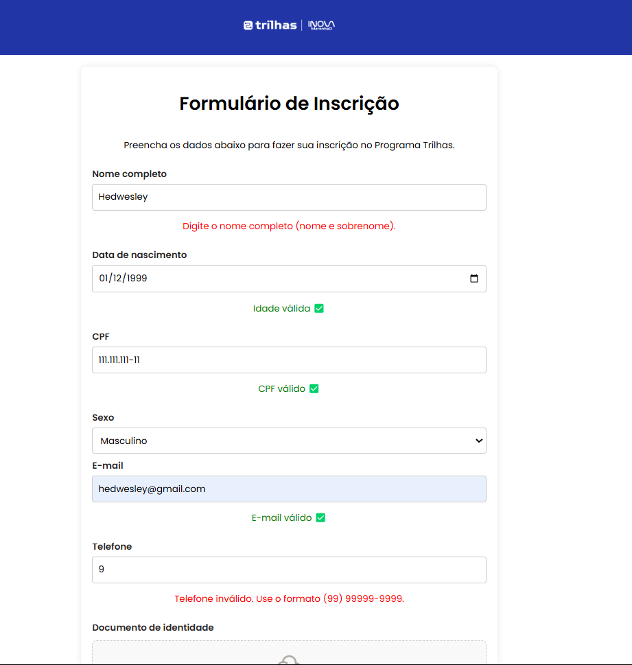
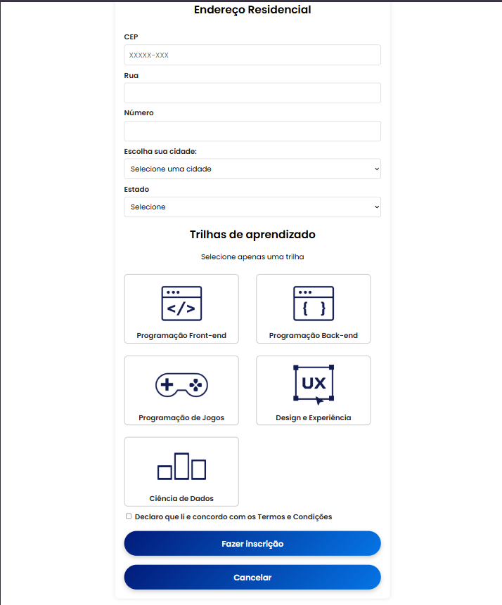

# Formulário de Inscrição - Trilhas 2B

Este repositório contém um formulário de inscrição desenvolvido como parte do desafio do **Programa Trilhas 2B**, promovido pelo Governo do Estado do Maranhão, SECTI e FAPEMA.

## 📌 Objetivo

Criar uma página responsiva e estática em **HTML e CSS**, baseada no design disponibilizado no Figma, contendo todos os campos e elementos necessários para o processo de inscrição no programa.

## 🛠 Tecnologias Utilizadas

- **HTML5**
- **CSS3**
- **Flexbox** e **Grid Layout** para responsividade

## 📸 Captura de Tela

&#x20; 

## 📂 Estrutura do Projeto

## 🚀 Como Executar o Projeto

1. Clone este repositório:
2. Acesse a pasta do projeto:
3. Abra o arquivo `index.html` em seu navegador.

## 🎨 Design Baseado no Figma

O design do formulário foi inspirado no modelo fornecido pelo desafio. Para acessá-lo, utilize o seguinte link:
[🔗 Figma - Trilhas 2B](https://www.figma.com/design/xMXycKv7AAwE7oVGJ1whpd/Desafio-2---Trilhas-2B?node-id=22-377\&p=f\&t=y4NR5blp1qxlMImV-0)

## 📌 Funcionalidades

- Layout responsivo
- Campos alinhados verticalmente
- Estilização baseada no guia de estilos do Figma

## 🤝 Contribuição

Se desejar contribuir, fique à vontade para abrir um pull request ou sugerir melhorias.

## 📝 Licença

Este projeto está sob a licença **MIT**. Sinta-se livre para usá-lo e modificá-lo conforme necessário.

---

Desenvolvido por [Hedwesley Gusmão](https://github.com/hedwesley) e [Lucas David]((https://github.com/Lucasdavid9)) 🚀
