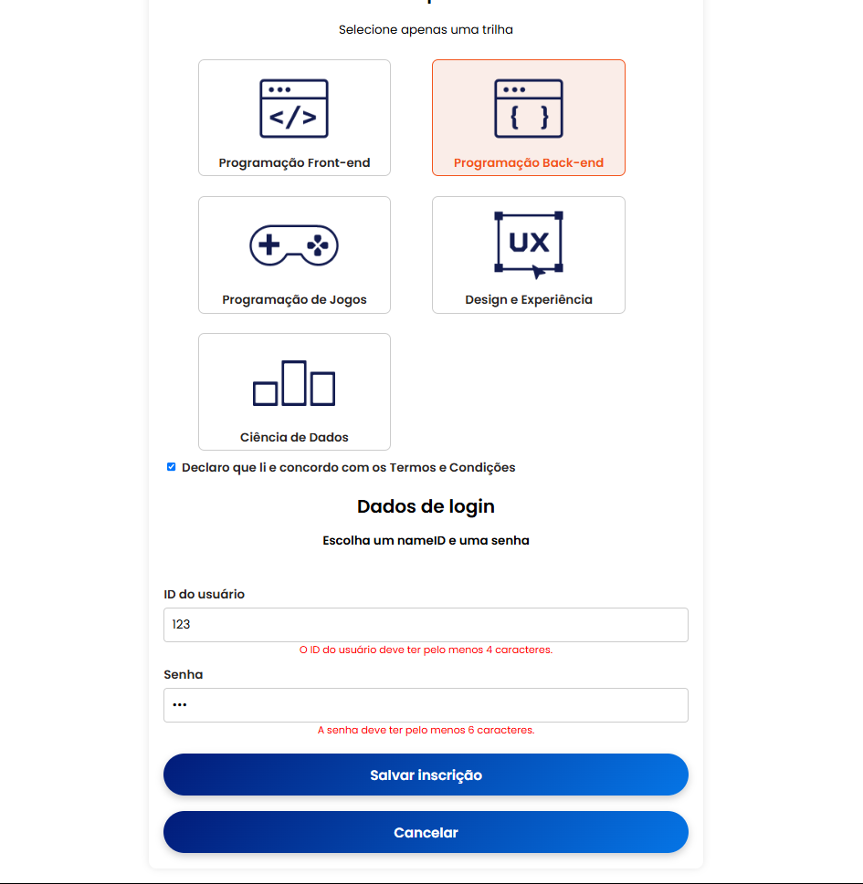
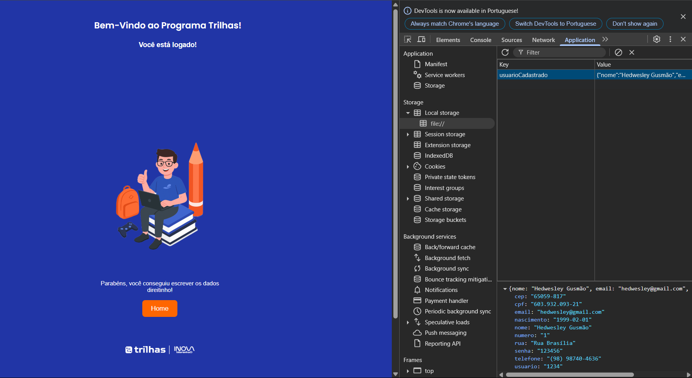

# Formulário de Inscrição - Trilhas 2B

Este repositório contém um formulário de inscrição desenvolvido como parte do desafio do **Programa Trilhas 2B**, promovido pelo Governo do Estado do Maranhão, SECTI e FAPEMA na construção de um formulário de inscrição completo, com validações em tempo real, salvamento de dados no localStorage e uma tela de login para autenticação do usuário.

## 📌 Objetivo

Criar uma página responsiva e estática em **HTML e CSS**, baseada no design disponibilizado no Figma, contendo todos os campos e elementos necessários para o processo de inscrição no programa.

## 🛠 Tecnologias Utilizadas

- **HTML5**
- **CSS3**
- **Flexbox** e **Grid Layout** para responsividade

## 📸 Captura de Tela

&#x20; 

## 📂 Estrutura do Projeto

## 🚀 Como Executar o Projeto

1. Clone este repositório:
2. Acesse a pasta do projeto:
3. Abra o arquivo `index.html` em seu navegador.

## 🎨 Design Baseado no Figma

O design do formulário foi inspirado no modelo fornecido pelo desafio. Para acessá-lo, utilize o seguinte link:
[🔗 Figma - Trilhas 2B](https://www.figma.com/design/xMXycKv7AAwE7oVGJ1whpd/Desafio-2---Trilhas-2B?node-id=22-377\&p=f\&t=y4NR5blp1qxlMImV-0)

## 📌 Funcionalidades

✨ Funcionalidades
✔️ Formulário de cadastro com os seguintes campos:

Nome completo

CPF (com validação de formato e dígitos verificadores)

E-mail (validação de formato)

Data de nascimento

Telefone (validação de formato)

Endereço completo (CEP, rua, número)

ID de usuário

Senha

✔️ Validações em tempo real:

Os campos são verificados enquanto o usuário digita.

O botão de "Fazer inscrição" só é habilitado quando todos os campos estão válidos.

✔️ Armazenamento local:

Ao clicar em "Fazer inscrição", os dados do usuário são salvos no localStorage do navegador.

✔️ Tela de login:

Valida o ID e a senha informados com os dados salvos no localStorage.

Exibe mensagens de sucesso ou erro conforme a tentativa de login.

✔️ Design responsivo:

Layout adaptado para diferentes tamanhos de tela (celular, tablet e desktop).

🛠️ Tecnologias utilizadas
HTML5

CSS3 (com media queries para responsividade)

JavaScript (puro, sem frameworks)

🔒 Validações implementadas
Nome: exige pelo menos duas palavras

CPF: valida estrutura e dígitos verificadores

E-mail: valida formato com regex

Data de nascimento: deve ser uma data válida no passado

Telefone: formato (XX) XXXXX-XXXX

CEP: formato XXXXX-XXX

Senha: no mínimo 6 caracteres

ID de usuário: obrigatório e único para autenticação

🚀 Como executar o projeto
Clone o repositório:

git clone https://github.com/Hedwesley/DesafioFormularioDeInscricao.git

Abra o arquivo index.html em um navegador moderno para testar o formulário.

Após realizar o cadastro, abra login.html para fazer o login com os dados salvos.

OBS: Os dados são armazenados localmente no navegador via localStorage.

📁 Estrutura do projeto
index.html → Tela de cadastro

login.html (ou abertura.html) → Tela de login

script.js → Arquivo JavaScript com validações e lógica de salvamento

styles.css → Estilos para layout e responsividade

📹 Demonstração em vídeo
O funcionamento completo do projeto está documentado em um vídeo demonstrativo, explicando o código, as funcionalidades e o raciocínio aplicado.

[Vídeo Parte 1](https://www.youtube.com/watch?v=TcBWnHosamQ&t=7s)
[Vídeo Parte 2](https://youtu.be/xnoDMH2IGu4)

👨‍💻 Autor
Desenvolvido por [Hedwesley Gusmão](https://github.com/hedwesley) e [Lucas David](https://github.com/seu-usuario) 🚀

—

## 🤝 Contribuição

Se desejar contribuir, fique à vontade para abrir um pull request ou sugerir melhorias.

## 📝 Licença

Este projeto está sob a licença **MIT**. Sinta-se livre para usá-lo e modificá-lo conforme necessário.

---